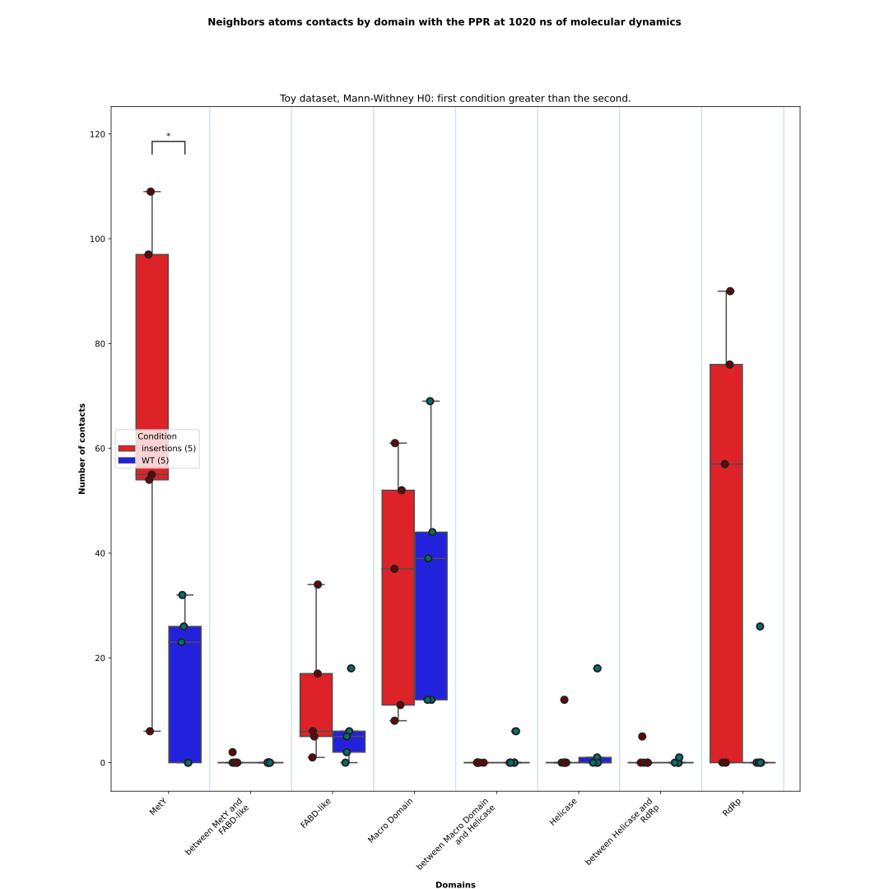
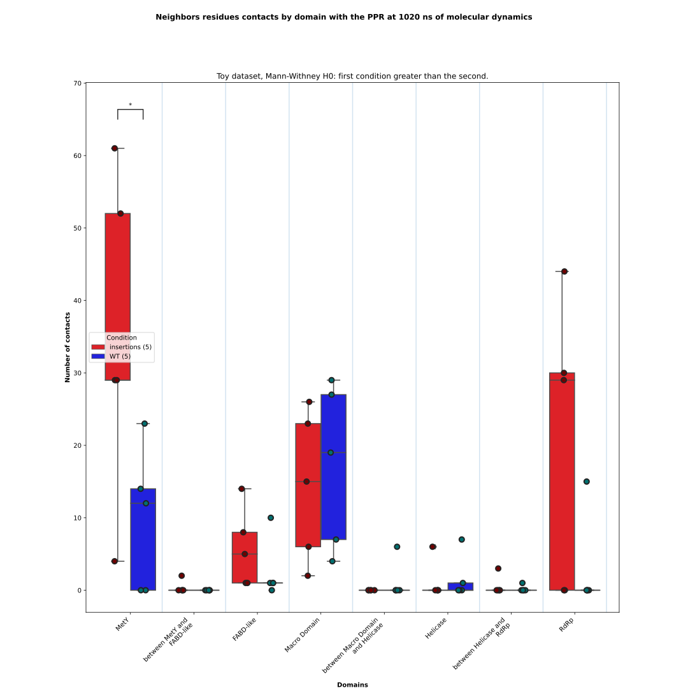

# Contacts aggregate

From the CSV files describing the contacts between a Region of Interest and the protein domains during the Molecular 
Dynamics simulation, the script generates boxplots of contacts (at the atomic and/or residue levels) for each condition. 
In addition, a file containing the results of the statistical tests is produced.

The input CSV data are produced by the [plot_hbonds](https://github.com/njeanne/plot_hbonds) or the [plot_neighbors](https://github.com/njeanne/plot_neighbors/tree/main) scripts.

If the data comes from the hydrogen bonds analysis, only "by residues"
files will be produced, else "by atoms" and "by residues" files will be produced.

## Conda environment

A [conda](https://docs.conda.io/projects/conda/en/latest/index.html) YAML environment file is provided: 
`conda_env/contacts_aggregate_env.yml`. The file contains all the dependencies to run the script.
The conda environment is generated using the command:
```shell script
# create the environment
conda env create -f conda_env/contacts_aggregate_env.yml

# activate the environment
conda activate contacts_aggregate
```

## Usage

The script can be tested with the test data provided in the `data` directory, which contains a CSV file describing the 
different conditions and the location of the directory containing the CSV output files from the [plot_hbonds.py](https://github.com/njeanne/plot_hbonds) 
script.

The input CSV file must be a comma separated file with a header as in the following example:

| condition    | path | boxplot color | dot color |
|--------------|---|---|---|
| insertions   | data/plot_neighbors_outputs/insertions | #fc030b | #700101 |
| WT           | data/plot_neighbors_outputs/WT | #0303fc | #017070 |

Some optional arguments can be used:
- `--domain`: which is the path to a CSV file describing the domains of a protein. The order of the domains will be used to order the boxplots in the plot.
- `--group`: to group some conditions of the input CSV file.

The command:
```shell script
conda activate contacts_aggregate

./contacts_aggregate.py --analysis neighbors --md-time 1020 --subtitle "Toy dataset" --domain data/domains.csv \
--out results data/conditions.csv

conda deactivate
```

## Outputs

The script outputs are:

- a CSV file listing the contacts by condition and domain:

|sample|conditions|domains                          |by atom|by residue|
|------|----------|---------------------------------|-------|----------|
|ins1  |insertions|FABD-like                        |1      |1         |
|ins1  |insertions|RdRp                             |90     |44        |
|ins1  |insertions|MetY                             |55     |29        |
|ins1  |insertions|Macro Domain                     |8      |2         |
|ins1  |insertions|between Helicase and RdRp        |0      |0         |
|ins1  |insertions|between Macro Domain and Helicase|0      |0         |
|ins1  |insertions|between MetY and FABD-like       |0      |0         |
|ins1  |insertions|Helicase                         |0      |0         |
|ins2  |insertions|Macro Domain                     |61     |26        |
|ins2  |insertions|FABD-like                        |5      |5         |
|ins2  |insertions|RdRp                             |76     |30        |
|ins2  |insertions|MetY                             |109    |52        |
|ins2  |insertions|between Helicase and RdRp        |0      |0         |
|ins2  |insertions|between Macro Domain and Helicase|0      |0         |
|ins2  |insertions|between MetY and FABD-like       |0      |0         |
|ins2  |insertions|Helicase                         |0      |0         |
|ins3  |insertions|FABD-like                        |6      |1         |
|ins3  |insertions|RdRp                             |57     |29        |
|ins3  |insertions|MetY                             |6      |4         |
|ins3  |insertions|Helicase                         |12     |6         |
|ins3  |insertions|between Helicase and RdRp        |5      |3         |
|ins3  |insertions|Macro Domain                     |11     |6         |
|ins3  |insertions|between Macro Domain and Helicase|0      |0         |
|ins3  |insertions|between MetY and FABD-like       |0      |0         |
|ins4  |insertions|FABD-like                        |34     |14        |
|ins4  |insertions|MetY                             |97     |61        |
|ins4  |insertions|between MetY and FABD-like       |2      |2         |
|ins4  |insertions|Macro Domain                     |37     |15        |
|ins4  |insertions|RdRp                             |0      |0         |
|ins4  |insertions|between Helicase and RdRp        |0      |0         |
|ins4  |insertions|between Macro Domain and Helicase|0      |0         |
|ins4  |insertions|Helicase                         |0      |0         |
|ins5  |insertions|FABD-like                        |17     |8         |
|ins5  |insertions|MetY                             |54     |29        |
|ins5  |insertions|Macro Domain                     |52     |23        |
|ins5  |insertions|RdRp                             |0      |0         |
|ins5  |insertions|between Helicase and RdRp        |0      |0         |
|ins5  |insertions|between Macro Domain and Helicase|0      |0         |
|ins5  |insertions|between MetY and FABD-like       |0      |0         |
|ins5  |insertions|Helicase                         |0      |0         |
|wt1   |WT        |Macro Domain                     |12     |7         |
|wt1   |WT        |MetY                             |0      |0         |
|wt1   |WT        |RdRp                             |0      |0         |
|wt1   |WT        |between Helicase and RdRp        |0      |0         |
|wt1   |WT        |between Macro Domain and Helicase|0      |0         |
|wt1   |WT        |FABD-like                        |0      |0         |
|wt1   |WT        |between MetY and FABD-like       |0      |0         |
|wt1   |WT        |Helicase                         |0      |0         |
|wt2   |WT        |FABD-like                        |6      |1         |
|wt2   |WT        |MetY                             |32     |23        |
|wt2   |WT        |Macro Domain                     |69     |29        |
|wt2   |WT        |Helicase                         |18     |7         |
|wt2   |WT        |RdRp                             |0      |0         |
|wt2   |WT        |between Helicase and RdRp        |0      |0         |
|wt2   |WT        |between Macro Domain and Helicase|0      |0         |
|wt2   |WT        |between MetY and FABD-like       |0      |0         |
|wt3   |WT        |Macro Domain                     |39     |19        |
|wt3   |WT        |MetY                             |23     |12        |
|wt3   |WT        |between Macro Domain and Helicase|6      |6         |
|wt3   |WT        |FABD-like                        |5      |1         |
|wt3   |WT        |Helicase                         |1      |1         |
|wt3   |WT        |RdRp                             |0      |0         |
|wt3   |WT        |between Helicase and RdRp        |0      |0         |
|wt3   |WT        |between MetY and FABD-like       |0      |0         |
|wt4   |WT        |FABD-like                        |18     |10        |
|wt4   |WT        |between Helicase and RdRp        |1      |1         |
|wt4   |WT        |Macro Domain                     |12     |4         |
|wt4   |WT        |MetY                             |0      |0         |
|wt4   |WT        |RdRp                             |0      |0         |
|wt4   |WT        |between Macro Domain and Helicase|0      |0         |
|wt4   |WT        |between MetY and FABD-like       |0      |0         |
|wt4   |WT        |Helicase                         |0      |0         |
|wt5   |WT        |RdRp                             |26     |15        |
|wt5   |WT        |FABD-like                        |2      |1         |
|wt5   |WT        |Macro Domain                     |44     |27        |
|wt5   |WT        |MetY                             |26     |14        |
|wt5   |WT        |between Helicase and RdRp        |0      |0         |
|wt5   |WT        |between Macro Domain and Helicase|0      |0         |
|wt5   |WT        |between MetY and FABD-like       |0      |0         |
|wt5   |WT        |Helicase                         |0      |0         |


- boxplots of the contacts by conditions and domains at the atom and at the residue levels. Mann-Whitney tests with **first condition greater than the second as null hypothesis (`greater`)** are performed for each domain between each pair of conditions.
Only the significant p-values are annotated:
```shell
p-value annotation legend:
      ns: 5.00e-02 < p <= 1.00e+00
       *: 1.00e-02 < p <= 5.00e-02
      **: 1.00e-03 < p <= 1.00e-02
     ***: 1.00e-04 < p <= 1.00e-03
    ****: p <= 1.00e-04
```

At the atom level:


At the residue level:


- the CSV files of the Mann-Whitney test results with **group 1 greater than group 2 as the null hypothesis**.

At the atom level:

|contact with                     |group 1   |group 2|p-value             |statistic|test          |H0                           |comment|
|---------------------------------|----------|-------|--------------------|---------|--------------|-----------------------------|-------|
|MetY                             |insertions|WT     |0.029663530473261753|22.0     |Mann-Whitney U|insertions is greater than WT|       |
|between MetY and FABD-like       |insertions|WT     |0.2118553985833967  |15.0     |Mann-Whitney U|insertions is greater than WT|       |
|FABD-like                        |insertions|WT     |0.2641796636354744  |16.0     |Mann-Whitney U|insertions is greater than WT|       |
|Macro Domain                     |insertions|WT     |0.7351903504982742  |10.0     |Mann-Whitney U|insertions is greater than WT|       |
|between Macro Domain and Helicase|insertions|WT     |0.8849303297782918  |10.0     |Mann-Whitney U|insertions is greater than WT|       |
|Helicase                         |insertions|WT     |0.779656991755661   |10.0     |Mann-Whitney U|insertions is greater than WT|       |
|between Helicase and RdRp        |insertions|WT     |0.5                 |13.0     |Mann-Whitney U|insertions is greater than WT|       |
|RdRp                             |insertions|WT     |0.07896965525006522 |19.0     |Mann-Whitney U|insertions is greater than WT|       |


At the residue level:

|contact with                     |group 1   |group 2|p-value            |statistic|test          |H0                           |comment|
|---------------------------------|----------|-------|-------------------|---------|--------------|-----------------------------|-------|
|MetY                             |insertions|WT     |0.02927631507841329|22.0     |Mann-Whitney U|insertions is greater than WT|       |
|between MetY and FABD-like       |insertions|WT     |0.2118553985833967 |15.0     |Mann-Whitney U|insertions is greater than WT|       |
|FABD-like                        |insertions|WT     |0.13260269629575377|18.0     |Mann-Whitney U|insertions is greater than WT|       |
|Macro Domain                     |insertions|WT     |0.7896825396825395 |9.0      |Mann-Whitney U|insertions is greater than WT|       |
|between Macro Domain and Helicase|insertions|WT     |0.8849303297782918 |10.0     |Mann-Whitney U|insertions is greater than WT|       |
|Helicase                         |insertions|WT     |0.779656991755661  |10.0     |Mann-Whitney U|insertions is greater than WT|       |
|between Helicase and RdRp        |insertions|WT     |0.5                |13.0     |Mann-Whitney U|insertions is greater than WT|       |
|RdRp                             |insertions|WT     |0.07896965525006522|19.0     |Mann-Whitney U|insertions is greater than WT|       |

